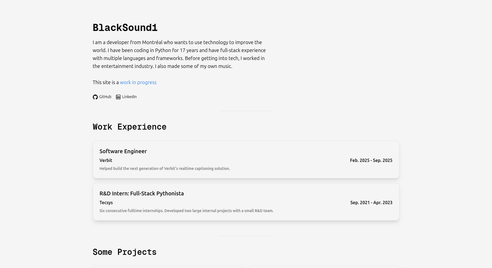

# BlackSound1's Portfolio Website

Upon realizing that I should probably have a portfolio, I decided to make one.
Not being a frontend -focused dev, I decided to just make a simple single-page static app using NextJS and some ShadCN components, where applicable.

Deployed At: https://blacksound1-portfolio.vercel.app/

## Features

- My social links
- My work experience
- My projects
- A theme selector (themes persist on reload):
  - My own default theme
  - Catpuccin (4 variants)
  - Everforest (2 variants)
  - Nord (2 variants)
  - Gruvbox (2 variants)
- An accent color picker to choose an arbitrary accent color for the site (persists on reload)
- A Soundcloud embed of my music. Can be styled by the accent color (persistent on reload). Since styling the Soundcloud embed requires reloading it after sending a request for a different color, there's a checkbox to prevent reloading on style change in case you were listening to a song. Won't re-style the embed until the checkbox is unchecked.

## Stack

- NextJS (React meta-framework)
- TypeScript (Language)
- ESLint (Linter)
- Vercel (Host)
- ShadCN (Component library)
- TailwindCSS (Style)
- Node.js (JavaScript runtime)
- PNPM (package manager)
- PostHog (Analytics)
- Prettier (Formatter)
- Just (Command runner)
